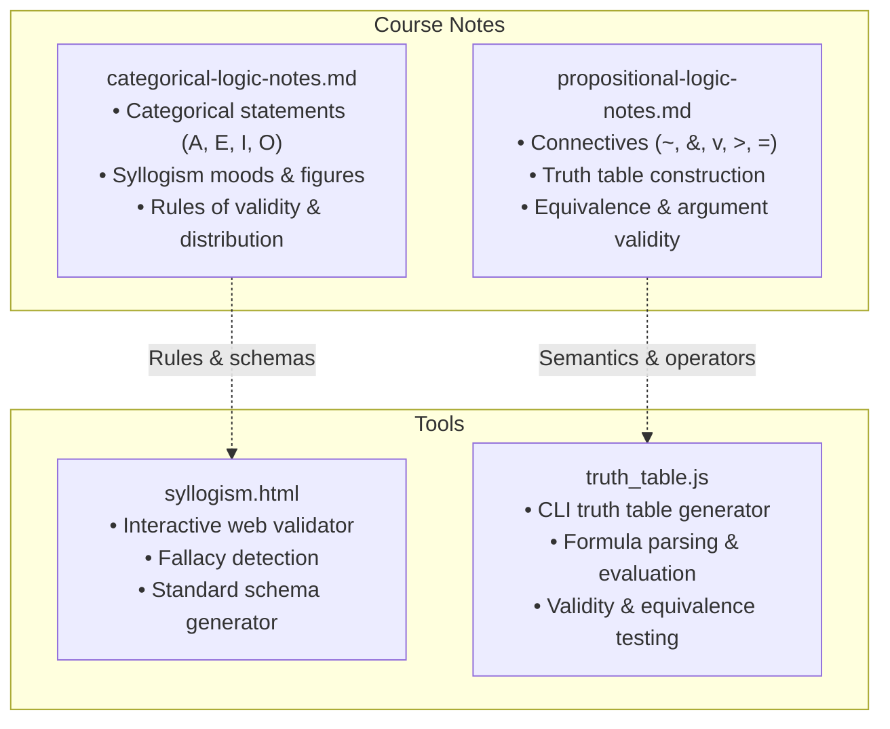

# Logic Toolkit

A collection of tools and course notes created for a logic elective class. The project includes an interactive web-based categorical syllogism validator, a command-line truth table generator for propositional logic, and reference notes covering both subjects.

---

## Table of Contents

- [Overview](#overview)
- [Repository Structure](#repository-structure)
- [Course Notes](#course-notes)
  - [Categorical Logic](#categorical-logic-categorical-logic-notesmd)
  - [Propositional Logic](#propositional-logic-propositional-logic-notesmd)
- [Syllogism Generator (`syllogism.html`)](#syllogism-generator-syllogismhtml)
  - [Features & Interface](#features--interface)
  - [How It Works](#how-it-works)
  - [Demo & Usage](#demo--usage)
- [Truth Table Generator (`truth_table.js`)](#truth-table-generator-truth_tablejs)
  - [Features & Supported Operators](#features--supported-operators)
  - [How It Works](#how-it-works-1)
  - [Demo & Usage](#demo--usage-1)
- [Author & License](#author--license)

---

## Overview

The repository covers two foundational areas of formal deductive logic studied in the course:

1. **Categorical Logic**: Analyzes relations between classes and terms within statements ($A, E, I, O$) arranged into standard-form syllogisms.
2. **Propositional Logic**: Evaluates arguments by treating propositions as variables connected by truth-functional operators ($\sim, \land, \lor, \supset, \equiv$).

Each script implements concepts from the corresponding set of notes:



---

## Repository Structure

| File | Description |
| :--- | :--- |
| [`categorical-logic-notes.md`](./categorical-logic-notes.md) | Class notes on Aristotelian term logic, definitions, categorical statements, distribution, syllogisms, and fallacies. |
| [`propositional-logic-notes.md`](./propositional-logic-notes.md) | Class notes on symbolic logic, truth tables, rules of inference/replacement, formal proofs, and Boolean logic. |
| [`syllogism.html`](./syllogism.html) | A single-page web app for validating standard-form categorical syllogisms and displaying their schema. |
| [`truth_table.js`](./truth_table.js) | A Node.js CLI script for parsing logical expressions, printing truth tables, and testing arguments. |

---

## Course Notes

### Categorical Logic ([`categorical-logic-notes.md`](./categorical-logic-notes.md))
Covers classical Aristotelian logic, which deals with arguments whose conclusions connect categories or terms. Key topics include:
- **Statement Types**: The four categorical propositions—**A** (*All S are P*), **E** (*No S are P*), **I** (*Some S are P*), and **O** (*Some S are not P*)—along with their quantity, quality, and the Square of Opposition.
- **Categorical Syllogisms**: Standard form (major premise, minor premise, conclusion), identifying major/minor/middle terms, moods (e.g. `AAA`), and figures (1–4).
- **Validity & Distribution**: Subject/predicate term distribution and the 5 classical rules of validity (and their corresponding fallacies: Undistributed Middle, Illicit Major/Minor, Two Negative Premises, and illicit negative/affirmative combinations).
- **Additional Topics**: Definitions (genus/difference), immediate inferences (conversion, obversion, contraposition), and informal fallacies.

### Propositional Logic ([`propositional-logic-notes.md`](./propositional-logic-notes.md))
Covers truth-functional deductive logic, where atomic propositions are combined into compound expressions using logical connectives:
- **Operators & Tables**: Defining truth tables for negation ($\sim$), conjunction ($\&$), disjunction ($v$), conditional/implication ($>$), and biconditional/equivalence ($=$).
- **Truth Table Analysis**: Generating $2^n$ truth rows to classify propositions (tautology, self-contradiction, contingent), check logical equivalence, and test argument validity (looking for rows with true premises and a false conclusion).
- **Formal Proofs**: The 9 rules of inference (e.g., Modus Ponens, Modus Tollens, Disjunctive Syllogism) and 10 rules of replacement (e.g., De Morgan's laws, Commutativity, Implication).
- **Digital Logic**: An introduction to binary arithmetic, logic gates, and Karnaugh maps (K-maps).

---

## Syllogism Generator (`syllogism.html`)

A lightweight web page that tests any of the 256 standard-form categorical syllogisms for validity.

```
+-------------------------------------------------------------------------------+
|  Mood: [ A ] [ A ] [ A ]          Undistributed Middle (Red)                  |
|Figure: [ 2 ]                                                                  |
|                                                                               |
|Clear Fields >>                                                                |
|Randomize >>                                                                   |
|Generate Schema >>                                                             |
|                                                                               |
|  +-------------------------------------------------------------------------+  |
|  | All P are M                                                             |  |
|  | All S are M                                                             |  |
|  | ∴ All S are P                                                           |  |
|  +-------------------------------------------------------------------------+  |
+-------------------------------------------------------------------------------+
```

### Features & Interface
- **Theme**: Minimalist dark UI inspired by Monkeytype (`#323437` background, `#e2b714` accents).
- **Quick Keyboard Input**: Automatically advances cursor focus between input boxes upon typing valid characters (`A`, `E`, `I`, `O` for mood; `1`–`4` for figure). Also supports arrow keys and `Enter`.
- **Status Display**: Shows a green "Valid" indicator for valid arguments, or a red list of specific fallacies when invalid (with abbreviated labels on smaller screens).
- **Schema Output**: The "Generate Schema" button expands a panel displaying the full syllogism in standard categorical form.

### How It Works
1. **Term Mapping**: An internal matrix (`xqc`) maps term positions ($M$, $S$, $P$) for the selected figure (1–4).
2. **Distribution Lookup**: A lookup table (`distr`) checks whether terms are distributed based on statement type ($A, E, I, O$).
3. **Fallacy Checks**: Evaluates the input against the 5 validity rules:
   - Middle term distributed at least once.
   - Any term distributed in the conclusion must be distributed in its premise.
   - No two negative premises.
   - Negative premise requires negative conclusion.
   - Two affirmative premises require affirmative conclusion.

### Demo & Usage
1. Open [`syllogism.html`](./syllogism.html) in any modern browser.
2. **Valid Syllogism (*Barbara*, `AAA-1`)**:
   - Enter Mood: `A`, `A`, `A` and Figure: `1`.
   - Result: Green **Valid** appears. Click **Generate Schema >>** to view the standard form.
3. **Invalid Syllogism (`AAA-2`)**:
   - Change Figure to `2`.
   - Result: Shows the **Undistributed Middle** fallacy in red.
4. **Multiple Fallacies (`EEA-1`)**:
   - Enter Mood: `E`, `E`, `A` and Figure: `1`.
   - Result: Displays both **Two Negative Premises** and **Negative Premise, Affirmative Conclusion**.
5. Use **Randomize >>** to practice identifying random forms, or **Clear Fields >>** to reset.

---

## Truth Table Generator (`truth_table.js`)

A small Node.js script for parsing propositional logic formulas and generating truth tables in the terminal.

### Features & Supported Operators
- Pure JavaScript with no external npm dependencies.
- ANSI color-coded terminal output (green for true/valid, red for false/invalid, and red background highlights for counterexample rows).
- Supports the following syntax:

| Symbol | Meaning | Example |
| :---: | :--- | :--- |
| `~` | Negation ($\sim$) | `~p` |
| `&` | Conjunction ($\land$) | `p&q` |
| `v` | Disjunction ($\lor$) | `pvq` |
| `>` | Conditional ($\supset$) | `p>q` |
| `=` | Biconditional ($\equiv$) | `p=q` |
| `()` | Parenthetical grouping | `~(p&q) = (~pv~q)` |

### How It Works
- **`parse(str, eval)`**: Recursively parses parentheses and operators. When building variable lists, it registers terms in a dictionary; when evaluating, it calculates the truth value for the current row.
- **`getBooleanCombinations(n)`**: Generates all $2^n$ combinations of truth values for $n$ variables.
- **`evalSingle(str)`**: Prints the truth table for a single formula.
- **`evalMultipleEquiv([str1, str2, ...])`**: Evaluates multiple expressions side-by-side to check if they are logically equivalent across all rows.
- **`evalArgValidity([premise1, premise2, ...], conclusion)`**: Evaluates an argument form. If a row has all true premises and a false conclusion, it flags the row as invalid.

### Demo & Usage

#### Running the Script
Run with Node.js:
```bash
node truth_table.js
```

Running the file directly executes four built-in demonstration examples:
1. **Single Proposition**: Evaluates `~(p&q)`.
2. **Logical Equivalence**: Demonstrates De Morgan's Law by comparing `~(p&q)` with `~pv~q`.
3. **Valid Argument (Modus Ponens)**: Tests premises `[p>q, p]` with conclusion `q`.
4. **Invalid Argument (Affirming the Consequent)**: Tests premises `[p>q, q]` with conclusion `p`, highlighting the failing row where $p=F, q=T$.

#### Using as a Module
The functions can also be imported into other scripts:
```javascript
const { evalSingle, evalMultipleEquiv, evalArgValidity } = require('./truth_table.js');

// Print a truth table
evalSingle('p>q');

// Check equivalence
evalMultipleEquiv(['p>q', '~pvq']);

// Test argument validity
evalArgValidity(['p>q', '~q'], '~p'); // Modus Tollens (Valid)
```

---

## Author & License

- **Author**: Peter Edvardsson
- **Context**: Logic Elective Coursework
- **License**: MIT
